# Ghost in the heap - Write up


### Program

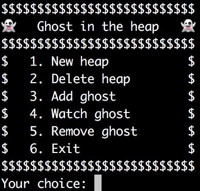

+ New heap
	+ Allocate a 168 bytes heap.
	+ You can only have three heap.
+ Delete heap
	+ Delete heap by index. 
+ Add ghost
	+ Add a ghost with magic
	+ You can only have one ghost.

```
struct Ghost {
    char desc[0x48] ;
    long magic ;
};
```

+ Watch ghost
	+ Show the information of ghost if magic is matched. 
+ Remove ghost
	+ Remove the ghost.	

### Vulnerability

+ off-by-one NULL byte in `new_heap`
	
	```
	void new_heap(){
    int i ;
    size_t size = 0;
    for(i = 0 ; i < MAX ; i++){
        if(!heap[i]){
            heap[i] = malloc(HEAPSIZE);
            if(!heap[i]){
                puts("Alloacte error !");
                _exit(-1);
            }
            printf("Data :");
            scanf("%168s",heap[i]);
            return ;
        }
    }
    puts("Too many heap !");
}
	```
	
	+ The size of heap is 168 bytes, but it use `scanf("%168s",heap[i[)` to read input. It will puts a null byte in the end of input. If your length of input is equal to 168 byte, it would lead to off-byte one overflow.

+ Information leak

	+ It use read() to read input without NULL byte which leads to information leak. 

	```
	void read_input(char *buf,unsigned int size){
    	int ret ;
    	ret = read(0,buf,size);
    	if(ret <= 0){
       	 puts("read error");
        	_exit(1);
    	}
	}
	```
	
+ Exploitation

	+ Idea
		+ [Fail] Fastbin dup
			+ It only allocate a fastbin chunk.  
		+ [Fail] Unsorted bin attack to overwrite `_IO_list_all`.
			+ Because there are some vtable vertify in lastet libc.
		+ [Success] Unsoted bin attack to corrupt stdin buffer
			+ It's using `scanf` and it would use stdin buffer. So we can overwrite the `_IO_buf_end`,you will have a stdin buffer in libc. After do that you can control the flow.


	+ Information leak
		+ Heap address
			+ It a little hard to get heap address. Because we only have three smallbin and one fastbin chunk. 
				1. Add a ghost and three heap
				2. Remove the first heap and ghost
					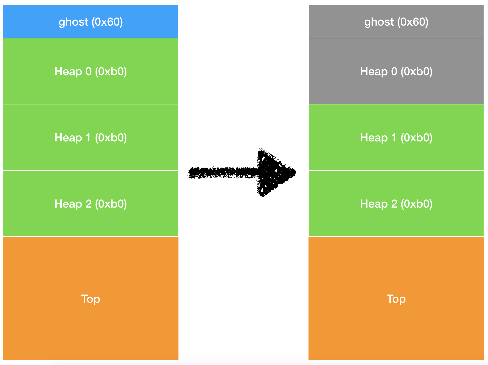
				3. Remove the last heap, it would merge with top and trigger `malloc_cosolidate`. The fastbin chunk would merge with unsorted chunk.
					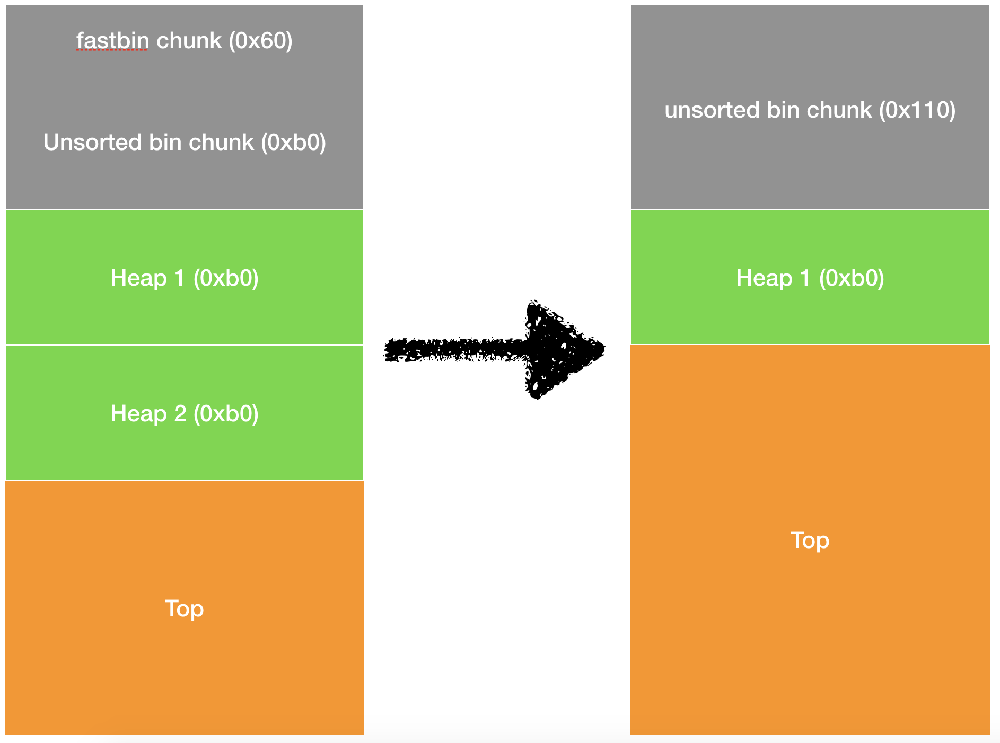
				4. Add two heap
					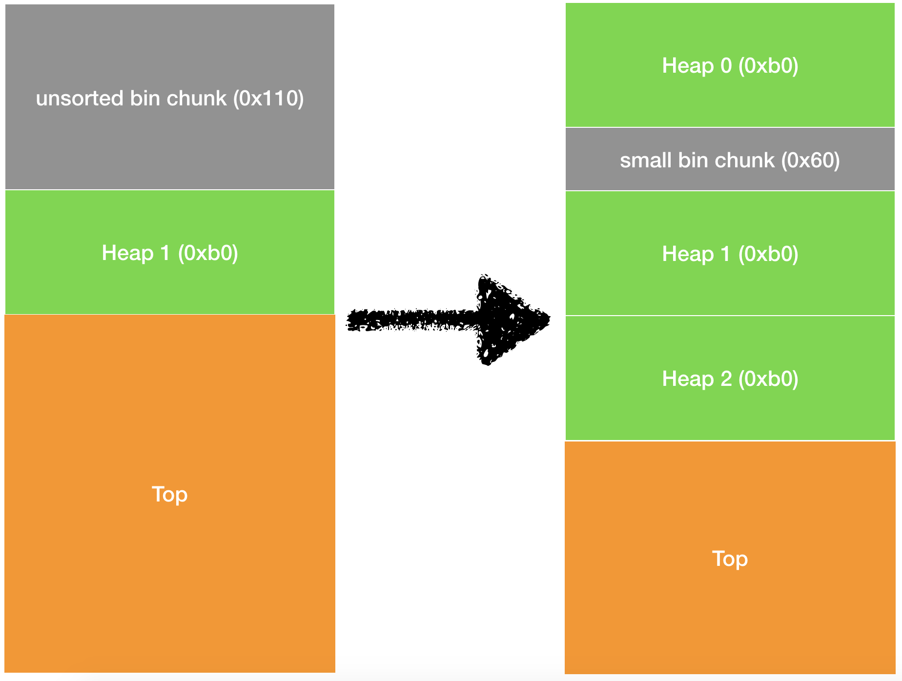
				5. Remove `Heap 1` so that it can merge with free chunk and return to unsorted bin.
					
				6. Add one heap, and remove `heap 0`. We can see that we have two chunk in unsoted bin, so we have heap address in the heap.
					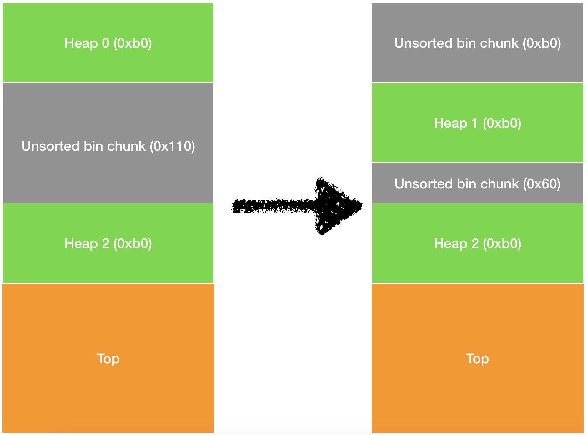
				7. Add ghost and we can get heap address by watching ghost
				
		+ Libc address
			+ It's easier than heap address. Just use unsorted chunk.


	+ Create a overlap chunk
		1. Remove ghost and all of heap
		2. Add a heap, ghost and two heap
		3. Remove `heap 0` and ghost
			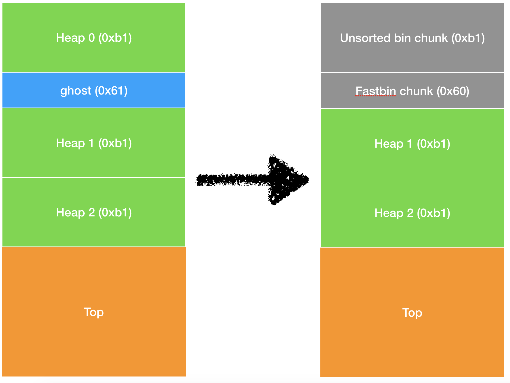
		4. Remove `heap 2` and it would trigger `malloc_consolidate`
			
		5. Add 2 heap
			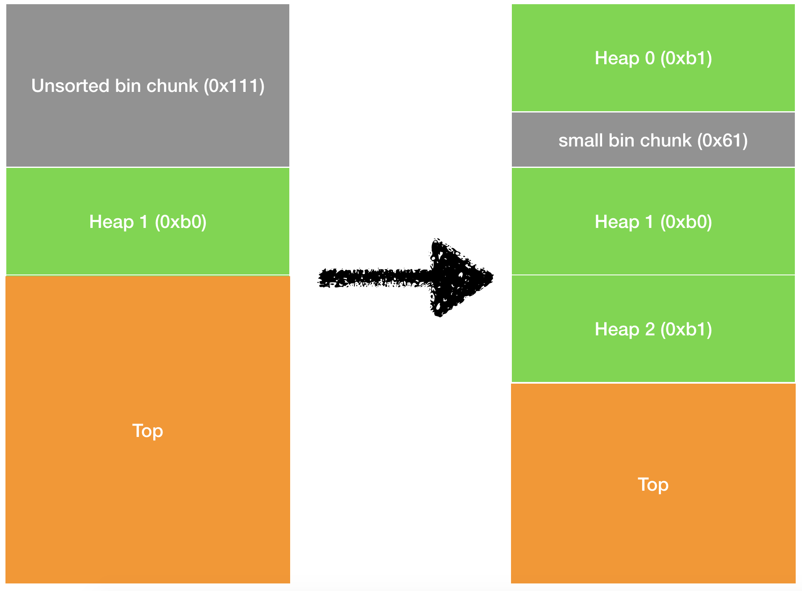
		6. Remove `heap 0` and `heap 1`
			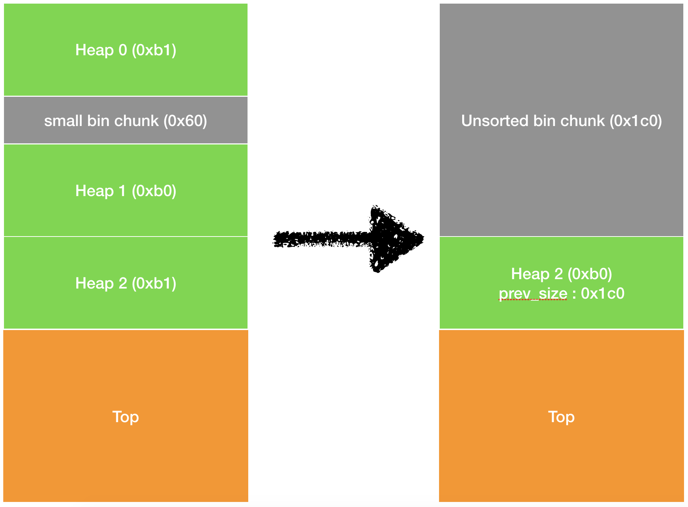
		7. Trigger the vulnerability
			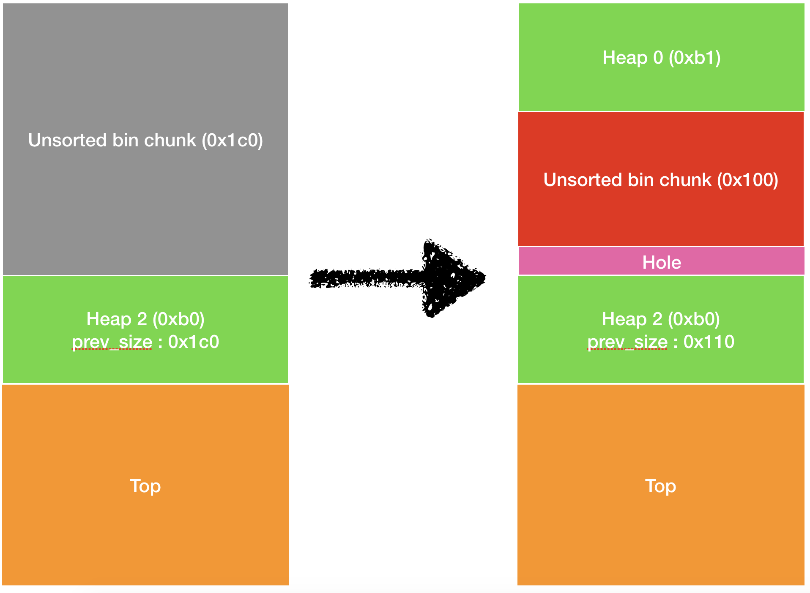
		8. Add 1 heap
			
		9. Remove `heap 1` (Let it can remove `heap 0`)
			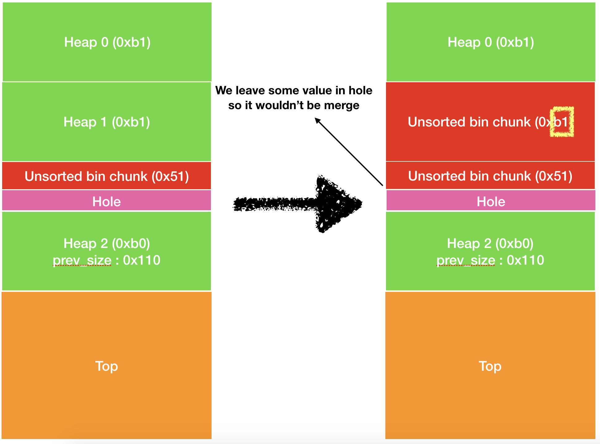
		10. Remove `heap 0`
			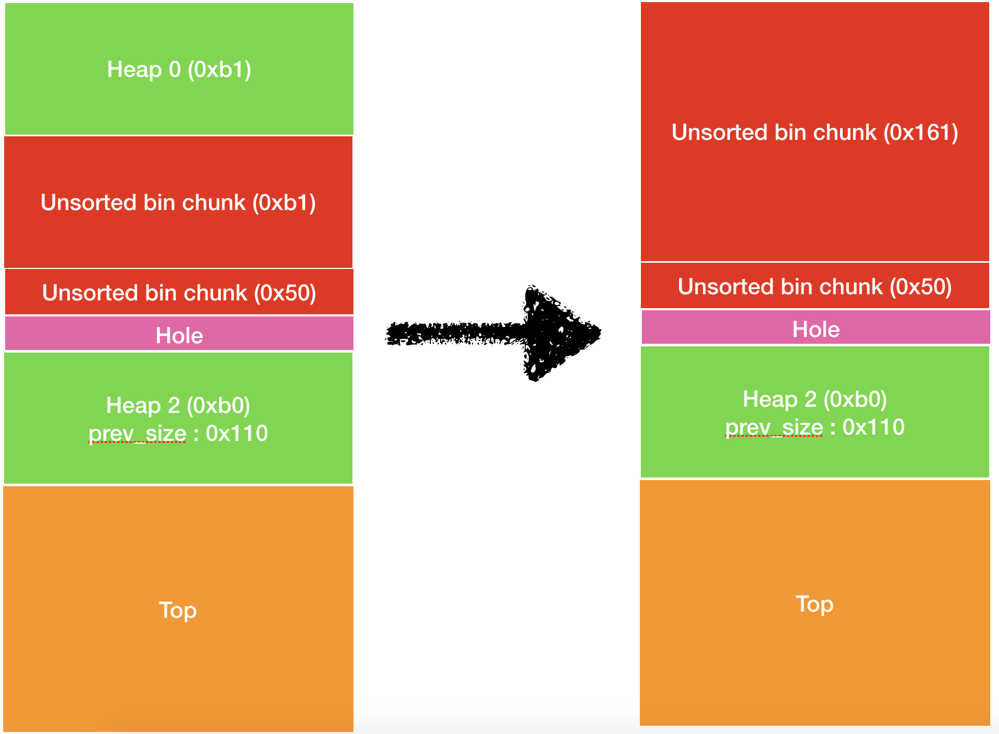
		11. Add a ghost
			
		12. Add a new heap and forge fake chunk
			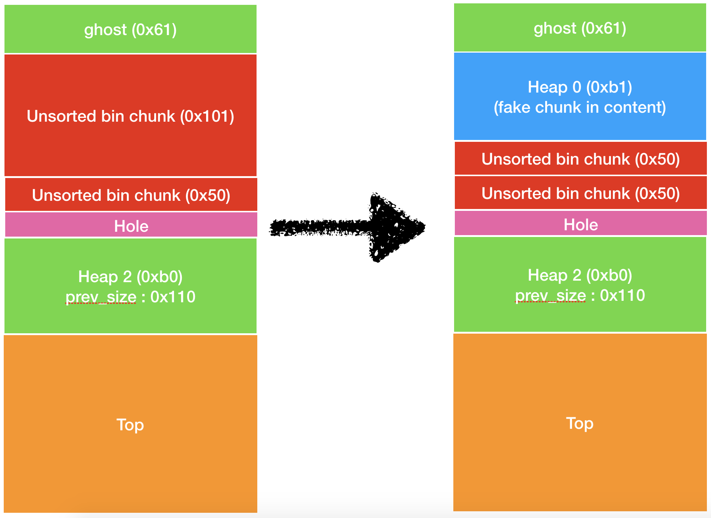
		13. Add a new heap and remove `heap 2`, then you can unlink success and create overlap chunk.
			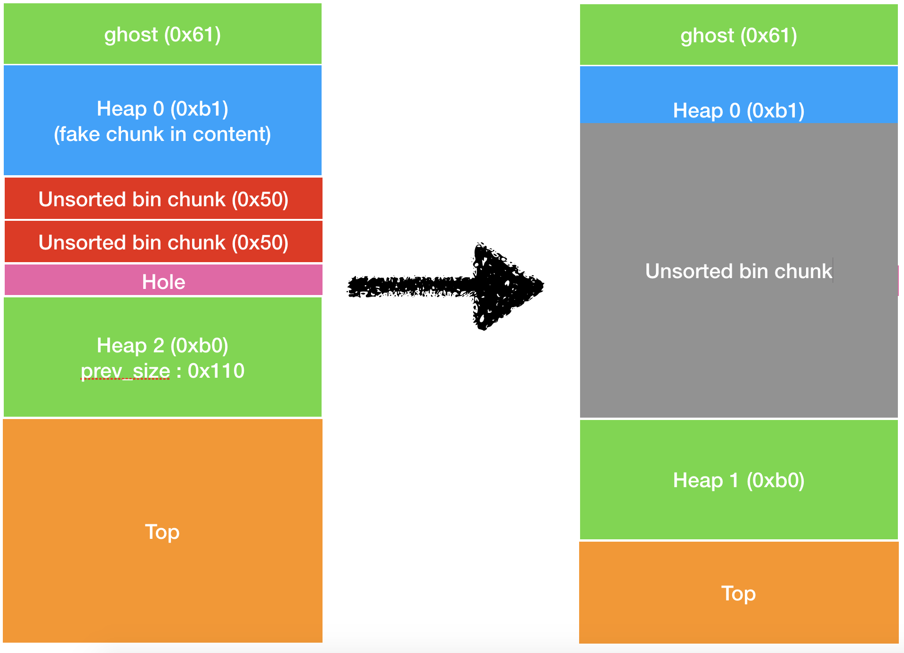
		14. More detail you can see my [exploit](./exp.py)

	+ Unsorted bin attack
		+ Use unsorted bin attak to overwrite `_IO_buf_end` 
		     
		+ Trigger `scanf()`
			+ It will read data to stdin buffer. You can use it to overwrite `malloc_hook` with one gadget
		+ Trigger `malloc` and you will get shell.
		+ More detail about FILE structure
			+ [Play with FILE Structure](http://4ngelboy.blogspot.tw/2017/11/play-with-file-structure-yet-another.html)
	+ Exploit
		+ [exp.py](./exp.py) 
